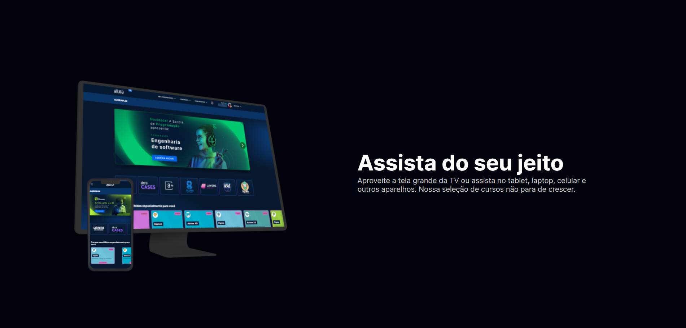
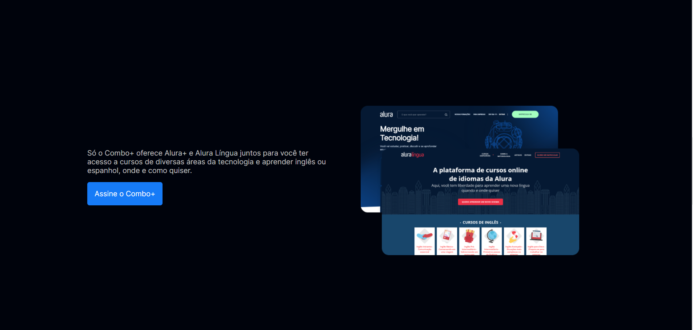
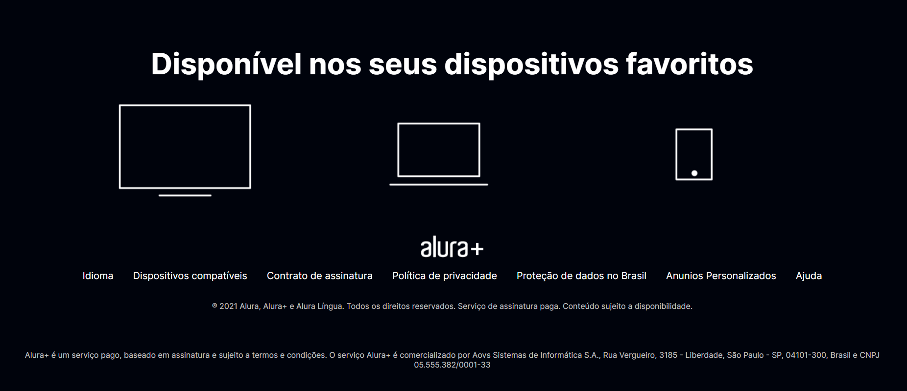

# Alura Plus

Project of Alura Plus Website

## Table of contents

- [Overview](#overview)
  - [The challenge](#the-challenge)
  - [Screenshot](#screenshot)
  - [Links](#links)
- [My process](#my-process)
  - [Built with](#built-with)
  - [What I learned](#what-i-learned)
  - [Continued development](#continued-development)
  - [Useful resources](#useful-resources)
- [Author](#author)

## Overview

A project challenged by [Alura](https://cursos.alura.com.br/imersao)

### The challenge

Users should be able to:

- Create AluraPlus page

    - using semantic tags
    - using css variables and media query;

### Screenshot

### Links

- Solution URL: [GitHub respository](https://github.com/ViniCellist/Alura-Plus)

## My process

Created the HTML structure, and apllied CSS style

### Built with

- HTML5
- CSS3
    - Flexbox
    - Grid

### What I learned

A first step into CSS grid

### Continued development

Keep my focus on becoming a fullstack Dev...

### Useful resources

- [HTML](https://developer.mozilla.org/en-US/docs/Web) 
- [CSS](https://developer.mozilla.org/en-US/docs/Web/CSS)

## Author

- GitHub - [Personal Profile](https://github.com/ViniCellist)
- LinkedIn - [Professional Profile](https://www.linkedin.com/in/viniciussouzaduarte/)
- Instagram - [Personal Profile](https://www.instagram.com/vinicius_duartesd/)
